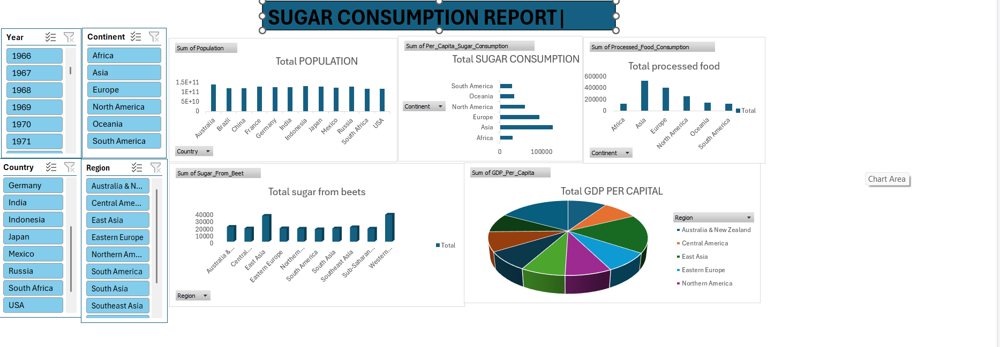
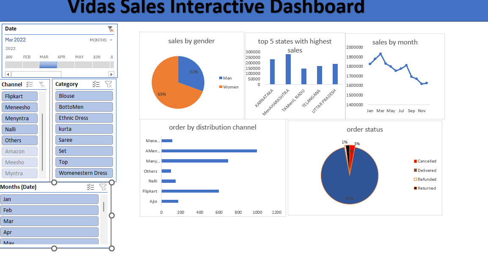

# Project 1

**Title:** [SUGAR CONSUMTION REPORT](https://view.officeapps.live.com/op/view.aspx?src=https%3A%2F%2Fraw.githubusercontent.com%2Fvivian744%2Fvivian74.github.io%2Frefs%2Fheads%2Fmain%2FMY%2520DASH%2520BOARD%2520sugar_consumption_dataset.xlsx&wdOrigin=BROWSELINK)

**Tools Used:** Microsoft Excel, Pivot table, Pivot cart and slicers

**Project Description:**  This project involved analysing  sugar consumption data, including total population and sugar from beet usage per region. It also breaks down sugar and processed food consumption by continent, and shows the sum of GDP per capita in each region.

Total population by country: Visual representation of population  broken down by each country.

Total sugar consumption by continent: The total units sugar consmed by continent, providing insights into sugar consumption trends over time.

Total sugar from beets by country : it Displays the total sugar from beets, allowing for easy comparison of countries over the years.

Total GDP per capital  by region: Highlights the total GDP generated in each region, showcasing the performance in different regions.

Total processed food by contitent: shows the total processed food by continent

Additionally, the dashboard includes interactive slicers for:

Year: Filter the data to view performance for a specific in  a year.

Country: Focus on specific countries to analyze regional performance.

Region: Drill down into the total quantity of sugar from beets and total GDP.

Continent: shows sugar consumption and total processed food.
 

**Key findings:**
The report reveals that North America leads in sugar consumption and processed food production, while Western Europe produces the most sugar from beets. In terms of GDP per capita, North America also tops the list.

**Dashboard Overview:**

# Project 2

**Title:** sales record- SQL data manupulation and interogation

**SQL Code:** [sales data sql code](https://github.com/vivian744/vivian74.github.io/blob/main/sales_data.sql)
**SQL Skills Used:** Data Retrieval (SELECT): Queried and extracted specific information from the database.
Data Aggregation (SUM, COUNT): Calculated totals, such as sales and quantities, and counted records to analyze data trends.
Data Filtering (WHERE, BETWEEN, IN, AND): Applied filters to select relevant data, including filtering by ranges and lists.
Data Source Specification (FROM): Specified the tables used as data sources for retrieval

**Project Description:** 

**Technology used:** SQL serve

# Project 3

**Title:** sugar consumption

**SQL Code:** [sugar comsumption data sql code](https://github.com/vivian744/vivian74.github.io/blob/main/sugar_consumption.sql)

**SQL Skills Used:** Data Retrieval (SELECT): Queried and extracted specific information from the database.
Data Aggregation (SUM, COUNT): Calculated totals, such as sales and quantities, and counted records to analyze data trends.
Data Filtering (WHERE, BETWEEN, IN, AND): Applied filters to select relevant data, including filtering by ranges and lists.
Data Source Specification (FROM): Specified the tables used as data sources for retrieval

**Project Description:**These queries are  analyzing different aspects of sugar consumption across various countries and years. They're looking at things like total sugar consumption, average consumption per person, and how these values change over time. 

**Technology used:** SQL server

# Project 4

**Title:**[vidas sales report](https://view.officeapps.live.com/op/view.aspx?src=https%3A%2F%2Fraw.githubusercontent.com%2Fvivian744%2Fvivian74.github.io%2Frefs%2Fheads%2Fmain%2F03%2520-%2520Data%2520Analyst%2520Excel%2520Project.xlsx&wdOrigin=BROWSELINK)

**Tools Used:** Microsoft Excel, Pivot table, Pivot cart and slicers, timeline

**Project Description:**
This project analyzes 2024 sales data for Vida stores, providing insights into performance across gender, state, and month. Key features include:
 * Total Sales by Gender: Visualized through a pie chart.
 * Total Sales by State: Presents a visual display of sales, highlighting the highest-performing states.
 * Total Sales by Month: Tracks monthly sales trends.
 * Order Delivery Status: Illustrated with a pie chart.
 * Interactive Slicers: Allow for dynamic data exploration by:
   * Channel: Identifying the distribution channel for each order.
   * Category: Examining sales across different product categories.
   * Month: Filtering data to view performance in specific months.
This dashboard offers a comprehensive understanding of sales patterns and delivery status, enabling data-driven decision-making.
**Key findings:**"Sales by Gender" pie chart, it appears men's sales are significantly higher than women's. The "Top 5 States with Highest Sales" bar graph shows menaharashtra leading. The "Sales by Month" line graph indicates a peak around March, with a sharp decline afterward and another peak around August. The "Order by Distribution Channel" chart highlights "Amenazon" as the most popular channel, and the "Order Status" pie chart shows a high percentage of completed orders. Would you like a more detailed breakdown of any of these areas?

**Dashboard Overview:**

# project 5

**Title:** [Healthcare project](https://github.com/vivian744/vivian74.github.io/blob/main/HEAALTHCARE%20PROJECT.pbix)

**Tools Used:** microsoft power Bi

**Project Description:**
Leveraged data visualization techniques to analyze key aspects of this data, including billing, gender, and medical conditions.
Key deliverables included:
>  * Visualized the prevalence of different medical conditions through a pie chart.
>  * Identified trends in hospital admissions for various medical conditions using a line chart.
>  * Compared test result distributions between male and female patients using a bar chart.
>  * Analyzed billing patterns by gender using a bar chart to highlight potential areas for review.
>  * Examined the age distribution within gender groups using a bar chart.
>  * Enhanced data exploration capabilities by integrating interactive slicers and a 2019-2024 timeline for targeted analysis.
>  * Summarized the overall billing amount in a readily understandable card.
>  * Provided a gender filter to facilitate focused investigations.

**Key findings:**[00:55, 18/05/2025] Vivian: The key findings are that obesity is the most common medical condition, and the total billing amount is 1.42 billion. Is there anything else you'd like to know about this report?
 The line chart shows a decrease in admissions for all medical conditions from 2019 to 2024. The bar graphs indicate that billing amounts are similar for both genders and that there are more male patients than female patients. The age distribution is skewed, with more patients in the older age ranges.

**Dashboard Overview:**

# project 6

**Title:** [Global sales](https://github.com/vivian744/vivian74.github.io/blob/main/03%20-%20Data%20Analyst%20Excel%20Project.xlsx)

**Tools Used:**microsoft power Bi

**Project Description:** A comprehensive dashboard to analyze and visualize global sales performance. Key metrics displayed include total sales by month (line chart), total sales by market (donut chart), shipping mode distribution across segments (pie chart), total profit by top 5 states (bar chart), and total quantity by country (line and bar charts highlighting the top 5). Integrated interactive slicers for Category, Market, and Order Date, facilitating dynamic filtering and in-depth analysis.

**Key findings:** The total sales are $1.3 million, with the consumer segment being the largest. The total profit is $11.31 million, and the total shipping cost is $1.22 million. The USMCA region has the highest sales, and the United States leads in sales by country. 
 The United States leads in quantity with 6.53 million.
 For profit by state, California leads with 2.87 million, followed by New York with 1.39 million. Illinois has 926.86 thousand, and Pennsylvania has 699.28 thousand.

**Dashboard Overview:**

